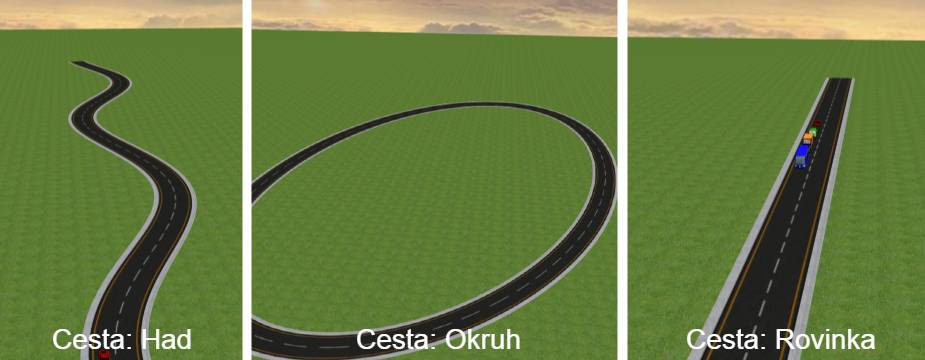
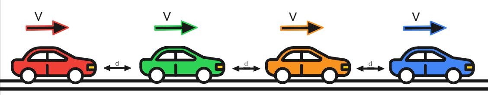
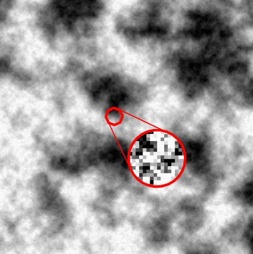
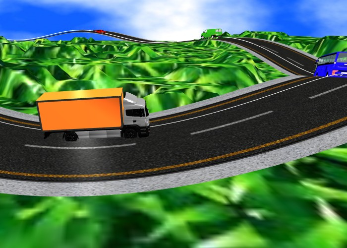
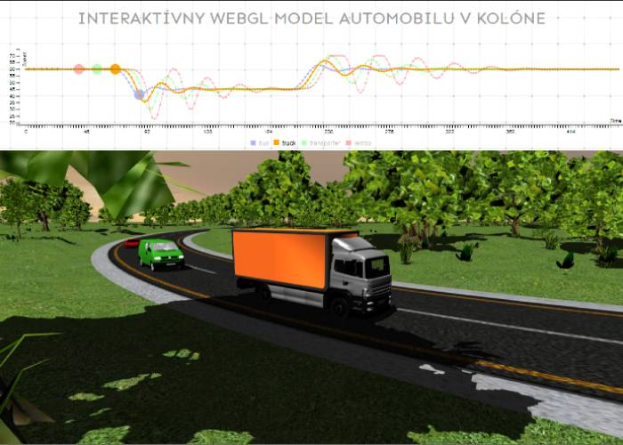

# Repo for bachelor thesis - Interactive WebGL model of a car platoon

## Abstract
The aim of my bachelor thesis was to design and create a web application that allows
the simulation of a car behaviour in a platoon. This web application gives the user the
opportunity to view the car in a platoon using an interactive simulation. This bachelor
thesis consists of three main parts. The first part is an analysis of the researched topic, in
which we deal with the possibilities of creating computer simulations, simulation models
and WebGL models. The second part is the description of the solution, in which we focus
on the technologies used in this work and the process itself. The third part is the technical
documentation, where we focus on the structure of our project and its settings. The result
of my bachelor thesis is the creation of a web application of an interactive WebGL model
that simulates a car in a traffic jam in real time based on data entered by the user.

## Some pictures






## Technologies - final
* babylon.js - 3d drawing 
* c3.js - charts
* gsap - animation
* jquery - dom manipulation  
* Matlab API for Web (+ simulink)
* blender - 3d model processing
* webpack
* npm


## Links
* demo - http://147.175.121.211/~filo/bp/
* thesis (sk) - https://opac.crzp.sk/?fn=detailBiblioForm&sid=69B07E5EF4F2B22F0586B9C7FD1B

## 3D objects downloaded from
* cars
    * transporter - https://www.cgtrader.com/free-3d-models/car/standard/vw-transporter-van-free-download
    * lambo - http://www.cadnav.com/3d-models/model-46794.html
    * bus - https://archive3d.net/?a=download&id=fe5e81c5
    * truck - https://archive3d.net/?a=download&id=60daa62c

* foliage
    * grass bush single - https://clara.io/view/011b032c-9cff-4276-a775-8d866332b90f
    * grass - https://clara.io/view/84fcfc62-6b3e-4820-92fd-f153b13b0570
    * tree - https://clara.io/view/7c7a05e2-e75e-4f7d-8fdb-a24f910f06eb
    * tree thiccc - https://clara.io/view/abb22f6d-6cf9-49c5-a27f-b0030543f89f

## Author's note
this repo became quite a mess :)

--- 

still.. if you want to run the app
```
cd web_tube_test
yarn install
yarn start
```

